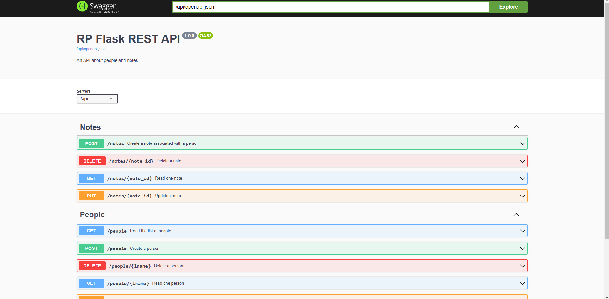
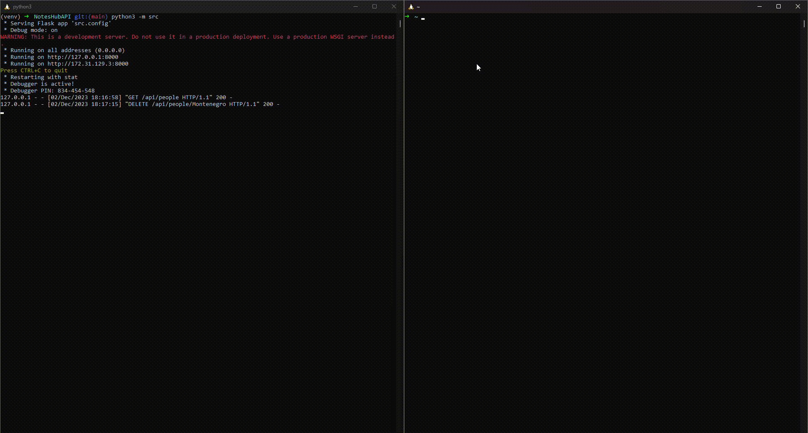

# NotesHubAPI

The NotesHubAPI is a Flask-based REST API integrated with an SQLite3 database. The primary goal of this API is to efficiently store a list of users and their respective messages.

## Features

- **User Registration**: Allows the registration of new users on the platform.

- **Message Storage**: Enables users to save their messages through the API.

- **Data Retrieval**: Provides endpoints to retrieve information about users and their messages.
  
- **Swagger Documentation**: Provides clean docs.



## Setup

1. Clone the repository:

   ```bash
   git clone https://github.com/your-username/NotesHubAPI.git
   cd NotesHubAPI
   ```
2. Create venv:
Create a virtual environment:

  ````bash
  python3 -m venv venv
  source venv/bin/activate
  Create a virtual environment (Windows):
  ````
  ````bash
  Copy code
  python3 -m venv venv
  venv\bin\activate  (Linux)
  ````
3. Install dependencies:

   ```bash
   pip -r install requirements.txt
   ```

4. Create databease:

   ```bash
   python3 build_database.py
   ```
   
5. Run the application:

   ```bash
   python3 -m src
   ```

   
